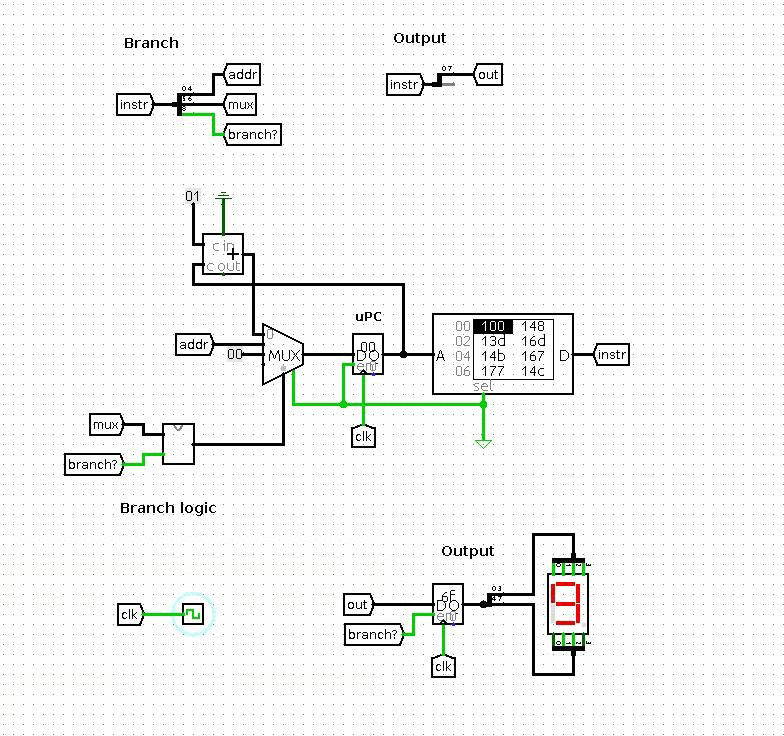

### Microcoded finite state machine



```python
...
...

microprogramm = commands([
	output(digit_code(0)),
	output(digit_code(1)),
	output(digit_code(2)),
	output(digit_code(3)),
	output(digit_code(4)),
	output(digit_code(5)),
	output(digit_code(6)),
	output(digit_code(7)),
	output(digit_code(8)),
	output(digit_code(9)),
	goto(0)
	])


def rom2file(filename, opcodes):
	with open(filename, 'w') as f:
	...
	...
```
